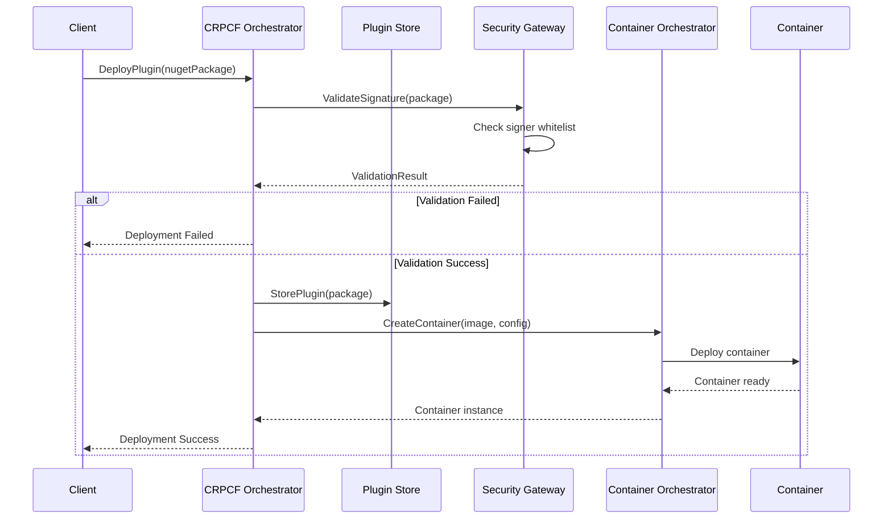
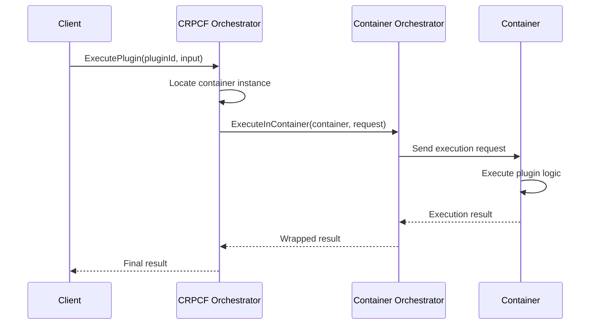

# Containerized RuntimePluggableClassFactory (CRPCF) - Technical Design Specification

## Executive Summary

This Technical Design Specification outlines the advanced containerized version of the RuntimePluggableClassFactory (CRPCF), enabling secure execution of NuGet packages within isolated containers. The CRPCF acts as an orchestrator, managing plugin distribution and lifecycle while supporting multiple container orchestration platforms including Kubernetes, Azure Container Apps, and other container systems.

## 1. Architecture Overview

### 1.1 System Components

```
┌─────────────────────────────────────────────────────────────────┐
│                    CRPCF Orchestrator                           │
│  ┌─────────────────┐  ┌─────────────────┐  ┌─────────────────┐ │
│  │   Plugin Store  │  │Security Gateway │  │  Orchestration  │ │
│  │   Management    │  │   & Validation  │  │     Engine      │ │
│  └─────────────────┘  └─────────────────┘  └─────────────────┘ │
└─────────────────────────────────────────────────────────────────┘
                                │
                    ┌───────────┴───────────┐
                    │                       │
    ┌─────────────────────────────┐  ┌─────────────────────────────┐
    │    Kubernetes CO            │  │  Azure Container Apps CO    │
    │  ┌─────────────────────┐    │  │  ┌─────────────────────┐    │
    │  │ Container Runtime   │    │  │  │ Container Runtime   │    │
    │  │ ┌─────────────────┐ │    │  │  │ ┌─────────────────┐ │    │
    │  │ │ Plugin Instance │ │    │  │  │ │ Plugin Instance │ │    │
    │  │ │   (NuGet Pkg)   │ │    │  │  │ │   (NuGet Pkg)   │ │    │
    │  │ └─────────────────┘ │    │  │  │ └─────────────────┘ │    │
    │  └─────────────────────┘    │  │  └─────────────────────┘    │
    └─────────────────────────────┘  └─────────────────────────────┘
```

### 1.2 Key Architectural Principles

- **Separation of Concerns**: CRPCF handles orchestration, CO handles container management
- **Security First**: All NuGet packages must be signed by whitelisted entities
- **Platform Agnostic**: Support for multiple container orchestration platforms
- **Scalability**: Horizontal scaling through container orchestration
- **Isolation**: Complete runtime isolation between plugin instances

## 2. Core Components Specification

### 2.1 CRPCF Orchestrator

#### 2.1.1 Responsibilities
- **Plugin Lifecycle Management**: Discovery, validation, deployment, execution, and cleanup
- **Security Enforcement**: Signature validation and whitelist management
- **Container Interface**: Communication with Container Orchestrators (CO)
- **Code Distribution**: Delivering plugin code to CO instances on-demand
- **Versioning**: Managing plugin versions and update notifications
- **Monitoring**: Health checks, performance metrics, and logging

#### 2.1.2 Core Interfaces

```csharp
public interface IContainerizedPluginOrchestrator
{
    Task<PluginDeploymentResult> DeployPluginAsync(
        SignedNuGetPackage package, 
        ContainerOrchestrationTarget target,
        DeploymentConfiguration config);
    
    Task<PluginExecutionResult> ExecutePluginAsync(
        PluginIdentifier pluginId,
        ExecutionContext context,
        TimeSpan timeout);
    
    Task<bool> ValidatePluginSignatureAsync(
        NuGetPackage package,
        IEnumerable<TrustedSigner> whitelistedSigners);
    
    Task NotifyPluginUpdateAsync(
        PluginIdentifier pluginId,
        SemanticVersion newVersion);
}

public interface IContainerOrchestrator
{
    Task<ContainerInstance> CreateContainerAsync(
        ContainerImage image,
        ContainerConfiguration config);
    
    Task<ExecutionResult> ExecuteInContainerAsync(
        ContainerInstance container,
        ExecutionRequest request);
    
    Task DestroyContainerAsync(ContainerInstance container);
    
    Task<ContainerHealth> GetContainerHealthAsync(ContainerInstance container);
}
```

### 2.2 Plugin Store Management

#### 2.2.1 Signed NuGet Package Handling

```csharp
public class SignedNuGetPackage
{
    public NuGetPackageIdentity Identity { get; set; }
    public DigitalSignature Signature { get; set; }
    public SignatureValidationResult ValidationResult { get; set; }
    public byte[] PackageContent { get; set; }
    public PackageMetadata Metadata { get; set; }
}

public class SignatureValidationResult
{
    public bool IsValid { get; set; }
    public SignerInfo SignerInfo { get; set; }
    public TrustedSigner MatchedTrustedSigner { get; set; }
    public IEnumerable<SecurityIssue> Issues { get; set; }
    public DateTime ValidationTimestamp { get; set; }
}

public class TrustedSigner
{
    public string SignerName { get; set; }
    public string CertificateThumbprint { get; set; }
    public X509Certificate2 Certificate { get; set; }
    public SignerTrustLevel TrustLevel { get; set; }
    public IEnumerable<string> AllowedPackagePatterns { get; set; }
}

public enum SignerTrustLevel
{
    Restricted,     // Limited package patterns only
    Standard,       // Most packages allowed
    Elevated,       // All packages allowed
    SystemLevel     // System-level packages allowed
}
```

#### 2.2.2 Whitelist Management

```csharp
public interface ISignerWhitelistManager
{
    Task<bool> AddTrustedSignerAsync(TrustedSigner signer);
    Task<bool> RemoveTrustedSignerAsync(string signerIdentifier);
    Task<IEnumerable<TrustedSigner>> GetTrustedSignersAsync();
    Task<bool> ValidateSignerAsync(SignerInfo signer);
    Task<SignerValidationResult> ValidatePackageSignerAsync(
        NuGetPackage package, 
        string packageName);
}
```

### 2.3 Security Gateway & Validation

#### 2.3.1 Enhanced Security Validation

Building upon the existing security framework, the containerized version includes:

```csharp
public class ContainerizedPluginSecurityValidator : IPluginSecurityValidator
{
    private readonly ISignerWhitelistManager _whitelistManager;
    private readonly INuGetSignatureValidator _signatureValidator;
    private readonly IContainerSecurityPolicy _containerPolicy;

    public async Task<PluginSecurityValidationResult> ValidateNuGetPackageAsync(
        SignedNuGetPackage package)
    {
        var result = new PluginSecurityValidationResult();
        
        // 1. Signature validation
        var signatureResult = await ValidatePackageSignatureAsync(package);
        if (!signatureResult.IsValid)
        {
            result.AddCriticalIssue("Invalid or missing digital signature");
            return result;
        }
        
        // 2. Signer whitelist validation
        var signerResult = await _whitelistManager.ValidatePackageSignerAsync(
            package.ToNuGetPackage(), 
            package.Identity.Id);
        if (!signerResult.IsWhitelisted)
        {
            result.AddCriticalIssue($"Signer not in whitelist: {signerResult.SignerName}");
            return result;
        }
        
        // 3. Container security policy validation
        var containerResult = await ValidateContainerSecurityAsync(package);
        result.MergeResults(containerResult);
        
        return result;
    }
}

public class ContainerSecurityPolicy
{
    public bool AllowNetworkAccess { get; set; } = false;
    public bool AllowFileSystemAccess { get; set; } = false;
    public TimeSpan MaxExecutionTime { get; set; } = TimeSpan.FromMinutes(5);
    public long MaxMemoryUsageBytes { get; set; } = 512 * 1024 * 1024; // 512MB
    public IEnumerable<string> AllowedEnvironmentVariables { get; set; }
    public IEnumerable<string> BlockedSystemCalls { get; set; }
}
```

### 2.4 Container Orchestration Interface

#### 2.4.1 Platform-Agnostic Orchestration

```csharp
public abstract class ContainerOrchestrator : IContainerOrchestrator
{
    protected readonly ContainerSecurityPolicy _securityPolicy;
    protected readonly ILogger<ContainerOrchestrator> _logger;

    public abstract Task<ContainerInstance> CreateContainerAsync(
        ContainerImage image, 
        ContainerConfiguration config);
    
    protected virtual ContainerConfiguration ApplySecurityPolicy(
        ContainerConfiguration config)
    {
        return new ContainerConfiguration
        {
            Image = config.Image,
            MemoryLimit = Math.Min(config.MemoryLimit, _securityPolicy.MaxMemoryUsageBytes),
            NetworkPolicy = _securityPolicy.AllowNetworkAccess ? 
                NetworkPolicy.Enabled : NetworkPolicy.Disabled,
            FileSystemAccess = _securityPolicy.AllowFileSystemAccess ? 
                FileSystemAccess.ReadWrite : FileSystemAccess.None,
            ExecutionTimeout = _securityPolicy.MaxExecutionTime
        };
    }
}
```

#### 2.4.2 Kubernetes Container Orchestrator

```csharp
public class KubernetesContainerOrchestrator : ContainerOrchestrator
{
    private readonly IKubernetesClient _k8sClient;
    private readonly KubernetesConfiguration _config;

    public override async Task<ContainerInstance> CreateContainerAsync(
        ContainerImage image, 
        ContainerConfiguration config)
    {
        var secureConfig = ApplySecurityPolicy(config);
        
        var podDefinition = new V1Pod
        {
            Metadata = new V1ObjectMeta
            {
                Name = $"plugin-{Guid.NewGuid():N}",
                Labels = new Dictionary<string, string>
                {
                    ["app"] = "crpcf-plugin",
                    ["plugin-id"] = config.PluginId,
                    ["version"] = config.Version
                }
            },
            Spec = new V1PodSpec
            {
                Containers = new List<V1Container>
                {
                    new V1Container
                    {
                        Name = "plugin",
                        Image = image.FullName,
                        Resources = new V1ResourceRequirements
                        {
                            Limits = new Dictionary<string, ResourceQuantity>
                            {
                                ["memory"] = new ResourceQuantity($"{secureConfig.MemoryLimit}"),
                                ["cpu"] = new ResourceQuantity("500m")
                            }
                        },
                        SecurityContext = new V1SecurityContext
                        {
                            AllowPrivilegeEscalation = false,
                            ReadOnlyRootFilesystem = !secureConfig.FileSystemAccess.HasFlag(FileSystemAccess.Write),
                            RunAsNonRoot = true
                        }
                    }
                },
                RestartPolicy = "Never",
                SecurityContext = new V1PodSecurityContext
                {
                    RunAsNonRoot = true
                }
            }
        };

        var pod = await _k8sClient.CreateNamespacedPodAsync(podDefinition, _config.Namespace);
        
        return new KubernetesContainerInstance
        {
            PodName = pod.Metadata.Name,
            Namespace = _config.Namespace,
            Status = ContainerStatus.Starting
        };
    }
}
```

#### 2.4.3 Azure Container Apps Orchestrator

```csharp
public class AzureContainerAppsOrchestrator : ContainerOrchestrator
{
    private readonly ContainerAppsManagementClient _acaClient;
    private readonly AzureConfiguration _config;

    public override async Task<ContainerInstance> CreateContainerAsync(
        ContainerImage image, 
        ContainerConfiguration config)
    {
        var secureConfig = ApplySecurityPolicy(config);
        
        var containerApp = new ContainerApp
        {
            Location = _config.Location,
            Properties = new ContainerAppProperties
            {
                Configuration = new Configuration
                {
                    Ingress = new Ingress { External = false }, // Internal only for security
                    Secrets = new List<Secret>(),
                    ActiveRevisionsMode = ActiveRevisionsMode.Single
                },
                Template = new Template
                {
                    Containers = new List<Container>
                    {
                        new Container
                        {
                            Name = "plugin",
                            Image = image.FullName,
                            Resources = new ContainerResources
                            {
                                Memory = $"{secureConfig.MemoryLimit / (1024*1024)}Mi",
                                Cpu = 0.5
                            },
                            Env = secureConfig.EnvironmentVariables?.Select(kv => 
                                new EnvironmentVar 
                                { 
                                    Name = kv.Key, 
                                    Value = kv.Value 
                                }).ToList()
                        }
                    },
                    Scale = new Scale
                    {
                        MinReplicas = 0,
                        MaxReplicas = 1
                    }
                }
            }
        };

        var result = await _acaClient.ContainerApps.CreateOrUpdateAsync(
            _config.ResourceGroup,
            $"plugin-{Guid.NewGuid():N}",
            containerApp);

        return new AzureContainerInstance
        {
            Name = result.Name,
            ResourceGroup = _config.ResourceGroup,
            Status = ContainerStatus.Starting
        };
    }
}
```

## 3. Plugin Execution Flow

### 3.1 Plugin Deployment Sequence



### 3.2 Plugin Execution Sequence



## 4. Security Implementation

### 4.1 NuGet Package Signature Validation

```csharp
public class NuGetSignatureValidator : INuGetSignatureValidator
{
    public async Task<SignatureValidationResult> ValidatePackageAsync(
        Stream packageStream, 
        IEnumerable<TrustedSigner> trustedSigners)
    {
        using var package = new PackageArchiveReader(packageStream);
        
        // Extract signature information
        var signature = await ExtractSignatureAsync(package);
        if (signature == null)
        {
            return SignatureValidationResult.Invalid("Package is not signed");
        }

        // Validate signature integrity
        var integrityResult = await ValidateSignatureIntegrityAsync(signature, package);
        if (!integrityResult.IsValid)
        {
            return SignatureValidationResult.Invalid($"Signature integrity failed: {integrityResult.Error}");
        }

        // Check against whitelist
        var signerInfo = ExtractSignerInfo(signature);
        var trustedSigner = trustedSigners.FirstOrDefault(ts => 
            ts.CertificateThumbprint.Equals(signerInfo.CertificateThumbprint, 
            StringComparison.OrdinalIgnoreCase));

        if (trustedSigner == null)
        {
            return SignatureValidationResult.Invalid($"Signer not in whitelist: {signerInfo.SubjectName}");
        }

        // Validate package name against signer's allowed patterns
        var packageId = package.GetIdentity().Id;
        if (!IsPackageAllowedForSigner(packageId, trustedSigner))
        {
            return SignatureValidationResult.Invalid(
                $"Package '{packageId}' not allowed for signer '{trustedSigner.SignerName}'");
        }

        return SignatureValidationResult.Valid(signerInfo, trustedSigner);
    }

    private bool IsPackageAllowedForSigner(string packageId, TrustedSigner signer)
    {
        if (!signer.AllowedPackagePatterns.Any())
            return signer.TrustLevel >= SignerTrustLevel.Standard;

        return signer.AllowedPackagePatterns.Any(pattern => 
            IsMatch(packageId, pattern));
    }

    private bool IsMatch(string packageId, string pattern)
    {
        // Support wildcard patterns like "MyCompany.*" or "MyCompany.Security.*"
        var regex = new Regex(pattern.Replace("*", ".*"), RegexOptions.IgnoreCase);
        return regex.IsMatch(packageId);
    }
}
```

### 4.2 Container Security Enforcement

```csharp
public class ContainerSecurityEnforcer
{
    public ContainerConfiguration ApplySecurityConstraints(
        ContainerConfiguration config, 
        PluginSecurityProfile profile)
    {
        return new ContainerConfiguration
        {
            // Resource limits
            MemoryLimit = Math.Min(config.MemoryLimit, profile.MaxMemoryBytes),
            CpuLimit = Math.Min(config.CpuLimit, profile.MaxCpuCores),
            
            // Network restrictions
            NetworkPolicy = profile.AllowedNetworkAccess.Contains(NetworkAccessType.None) 
                ? NetworkPolicy.Disabled 
                : NetworkPolicy.Restricted,
            
            // File system restrictions
            ReadOnlyFileSystem = !profile.RequiredPermissions.Contains(Permission.FileWrite),
            
            // Security context
            RunAsNonRoot = true,
            AllowPrivilegeEscalation = false,
            
            // Execution constraints
            ExecutionTimeout = TimeSpan.FromMinutes(Math.Min(
                config.ExecutionTimeout.TotalMinutes, 
                profile.MaxExecutionMinutes)),
            
            // Environment restrictions
            AllowedEnvironmentVariables = profile.AllowedEnvironmentVariables
        };
    }
}
```

## 5. Configuration Management

### 5.1 CRPCF Configuration

```yaml
# crpcf-config.yaml
crpcf:
  orchestrator:
    name: "CRPCF-Main"
    version: "2.0.0"
    
  security:
    require_signed_packages: true
    signature_validation_timeout: 30s
    trusted_signers_config_path: "/config/trusted-signers.json"
    
  plugin_store:
    type: "filesystem" # or "azureblob", "s3"
    path: "/data/plugins"
    max_size_gb: 100
    cleanup_policy:
      max_age_days: 30
      max_versions_per_plugin: 5
      
  container_orchestration:
    default_platform: "kubernetes"
    platforms:
      kubernetes:
        namespace: "crpcf-plugins"
        service_account: "crpcf-sa"
        node_selector:
          plugin-node: "true"
      azure_container_apps:
        resource_group: "crpcf-rg"
        location: "eastus"
        
  monitoring:
    metrics_enabled: true
    logging_level: "info"
    health_check_interval: 30s
```

### 5.2 Trusted Signers Configuration

```json
{
  "trustedSigners": [
    {
      "signerName": "Microsoft Corporation",
      "certificateThumbprint": "3F3E0316F5E61A2CACCF84E3B31F9F9E7E6D3A71",
      "trustLevel": "SystemLevel",
      "allowedPackagePatterns": ["Microsoft.*", "System.*"]
    },
    {
      "signerName": "MyCompany Inc",
      "certificateThumbprint": "A1B2C3D4E5F6789012345678901234567890ABCD",
      "trustLevel": "Standard",
      "allowedPackagePatterns": ["MyCompany.*", "MyCompany.Plugins.*"]
    },
    {
      "signerName": "TrustedVendor LLC",
      "certificateThumbprint": "1234567890ABCDEF1234567890ABCDEF12345678",
      "trustLevel": "Restricted",
      "allowedPackagePatterns": ["TrustedVendor.SpecificPlugin"]
    }
  ],
  "validationSettings": {
    "requireTimestampSignature": true,
    "allowSelfSignedCertificates": false,
    "certificateRevocationCheck": true,
    "maxCertificateAge": "P2Y" // 2 years
  }
}
```

## 6. API Specifications

### 6.1 REST API Endpoints

```yaml
# OpenAPI 3.0 Specification
openapi: 3.0.0
info:
  title: Containerized RuntimePluggableClassFactory API
  version: 2.0.0
  description: API for managing containerized plugins

paths:
  /plugins:
    post:
      summary: Deploy a signed NuGet plugin
      requestBody:
        content:
          multipart/form-data:
            schema:
              type: object
              properties:
                package:
                  type: string
                  format: binary
                deploymentConfig:
                  $ref: '#/components/schemas/DeploymentConfiguration'
      responses:
        '201':
          description: Plugin deployed successfully
          content:
            application/json:
              schema:
                $ref: '#/components/schemas/PluginDeploymentResult'
                
  /plugins/{pluginId}/execute:
    post:
      summary: Execute a containerized plugin
      parameters:
        - name: pluginId
          in: path
          required: true
          schema:
            type: string
      requestBody:
        content:
          application/json:
            schema:
              $ref: '#/components/schemas/ExecutionRequest'
      responses:
        '200':
          description: Plugin executed successfully
          content:
            application/json:
              schema:
                $ref: '#/components/schemas/ExecutionResult'

components:
  schemas:
    DeploymentConfiguration:
      type: object
      properties:
        targetPlatform:
          type: string
          enum: [kubernetes, azure-container-apps, docker]
        securityProfile:
          $ref: '#/components/schemas/SecurityProfile'
        resourceLimits:
          $ref: '#/components/schemas/ResourceLimits'
          
    SecurityProfile:
      type: object
      properties:
        allowNetworkAccess:
          type: boolean
        allowFileSystemAccess:
          type: boolean
        maxExecutionTimeMinutes:
          type: integer
```

### 6.2 gRPC Service Definition

```protobuf
syntax = "proto3";

package crpcf.v1;

service ContainerizedPluginService {
  rpc DeployPlugin(DeployPluginRequest) returns (DeployPluginResponse);
  rpc ExecutePlugin(ExecutePluginRequest) returns (ExecutePluginResponse);
  rpc GetPluginStatus(GetPluginStatusRequest) returns (GetPluginStatusResponse);
  rpc UndeployPlugin(UndeployPluginRequest) returns (UndeployPluginResponse);
  rpc ListPlugins(ListPluginsRequest) returns (ListPluginsResponse);
}

message DeployPluginRequest {
  bytes nuget_package = 1;
  DeploymentConfiguration config = 2;
}

message DeployPluginResponse {
  string plugin_id = 1;
  string deployment_status = 2;
  repeated string validation_warnings = 3;
}

message ExecutePluginRequest {
  string plugin_id = 1;
  string input_data = 2;
  ExecutionConfiguration config = 3;
}

message ExecutionConfiguration {
  int32 timeout_seconds = 1;
  map<string, string> environment_variables = 2;
}
```

## 7. Deployment Architecture

### 7.1 High Availability Setup

```yaml
# kubernetes-deployment.yaml
apiVersion: apps/v1
kind: Deployment
metadata:
  name: crpcf-orchestrator
spec:
  replicas: 3
  selector:
    matchLabels:
      app: crpcf-orchestrator
  template:
    metadata:
      labels:
        app: crpcf-orchestrator
    spec:
      serviceAccountName: crpcf-service-account
      containers:
      - name: orchestrator
        image: crpcf/orchestrator:2.0.0
        ports:
        - containerPort: 8080
        - containerPort: 9090
        env:
        - name: CRPCF_CONFIG_PATH
          value: "/config/crpcf-config.yaml"
        - name: TRUSTED_SIGNERS_PATH
          value: "/config/trusted-signers.json"
        volumeMounts:
        - name: config
          mountPath: /config
        - name: plugin-store
          mountPath: /data/plugins
        resources:
          requests:
            memory: "512Mi"
            cpu: "250m"
          limits:
            memory: "1Gi"
            cpu: "500m"
      volumes:
      - name: config
        configMap:
          name: crpcf-config
      - name: plugin-store
        persistentVolumeClaim:
          claimName: crpcf-plugin-store-pvc
```

### 7.2 Service Mesh Integration

```yaml
# istio-virtual-service.yaml
apiVersion: networking.istio.io/v1beta1
kind: VirtualService
metadata:
  name: crpcf-orchestrator
spec:
  http:
  - match:
    - uri:
        prefix: /api/v1/plugins
    route:
    - destination:
        host: crpcf-orchestrator-service
        port:
          number: 8080
    timeout: 300s
    retries:
      attempts: 3
      perTryTimeout: 60s
```

## 8. Monitoring and Observability

### 8.1 Metrics Collection

```csharp
public class CRPCFMetrics
{
    private static readonly Counter PluginDeployments = Metrics
        .CreateCounter("crpcf_plugin_deployments_total", 
        "Total number of plugin deployments", 
        new[] { "status", "platform" });
    
    private static readonly Histogram PluginExecutionDuration = Metrics
        .CreateHistogram("crpcf_plugin_execution_duration_seconds",
        "Duration of plugin executions",
        new[] { "plugin_id", "status" });
    
    private static readonly Gauge ActiveContainers = Metrics
        .CreateGauge("crpcf_active_containers",
        "Number of active plugin containers",
        new[] { "platform" });
    
    public void RecordDeployment(string status, string platform)
    {
        PluginDeployments.WithLabels(status, platform).Inc();
    }
    
    public void RecordExecution(string pluginId, string status, double durationSeconds)
    {
        PluginExecutionDuration.WithLabels(pluginId, status).Observe(durationSeconds);
    }
}
```

### 8.2 Distributed Tracing

```csharp
public class TracedPluginExecutor : IPluginExecutor
{
    private readonly IPluginExecutor _inner;
    private readonly ActivitySource _activitySource;

    public async Task<ExecutionResult> ExecuteAsync(ExecutionRequest request)
    {
        using var activity = _activitySource.StartActivity("plugin.execute");
        activity?.SetTag("plugin.id", request.PluginId);
        activity?.SetTag("plugin.version", request.Version);
        
        try
        {
            var result = await _inner.ExecuteAsync(request);
            activity?.SetTag("execution.status", result.Status);
            return result;
        }
        catch (Exception ex)
        {
            activity?.SetStatus(ActivityStatusCode.Error, ex.Message);
            throw;
        }
    }
}
```

## 9. Security Considerations

### 9.1 Threat Model

| Threat | Mitigation |
|--------|------------|
| Malicious unsigned packages | Mandatory signature validation with whitelist |
| Container breakout | Hardened container runtime with security policies |
| Privilege escalation | Non-root containers with minimal permissions |
| Network-based attacks | Network policies restricting container communication |
| Resource exhaustion | CPU/memory limits and execution timeouts |
| Data exfiltration | Read-only file systems and network restrictions |

### 9.2 Security Hardening Checklist

- [ ] All NuGet packages must be digitally signed
- [ ] Signature validation against trusted signers whitelist
- [ ] Container images scanned for vulnerabilities
- [ ] Non-root container execution enforced
- [ ] Network policies restrict inter-container communication
- [ ] Resource limits prevent DoS attacks
- [ ] Audit logging for all security-relevant events
- [ ] Regular rotation of signing certificates
- [ ] Encrypted communication between components
- [ ] Secrets management for sensitive configuration

## 10. Performance Characteristics

### 10.1 Performance Targets

| Metric | Target | Measurement Method |
|--------|--------|-------------------|
| Plugin Deployment Time | < 30 seconds | Time from upload to ready state |
| Cold Start Execution | < 5 seconds | Time from request to first response |
| Warm Execution | < 500ms | Time for subsequent executions |
| Concurrent Executions | > 1000 | Parallel execution capacity |
| Container Startup | < 10 seconds | Container ready state |
| Signature Validation | < 2 seconds | Package validation time |

### 10.2 Scalability Architecture

```yaml
# horizontal-pod-autoscaler.yaml
apiVersion: autoscaling/v2
kind: HorizontalPodAutoscaler
metadata:
  name: crpcf-orchestrator-hpa
spec:
  scaleTargetRef:
    apiVersion: apps/v1
    kind: Deployment
    name: crpcf-orchestrator
  minReplicas: 3
  maxReplicas: 20
  metrics:
  - type: Resource
    resource:
      name: cpu
      target:
        type: Utilization
        averageUtilization: 70
  - type: Resource
    resource:
      name: memory
      target:
        type: Utilization
        averageUtilization: 80
```

## 11. Implementation Roadmap

### Phase 1: Core Infrastructure (Months 1-3)
- [ ] CRPCF Orchestrator foundation
- [ ] Basic container orchestration interface
- [ ] NuGet signature validation system
- [ ] Trusted signers whitelist management
- [ ] Kubernetes container orchestrator implementation

### Phase 2: Security & Validation (Months 2-4)
- [ ] Enhanced security validation pipeline
- [ ] Container security policy enforcement
- [ ] Audit logging and monitoring
- [ ] Threat detection and response

### Phase 3: Platform Expansion (Months 3-5)
- [ ] Azure Container Apps orchestrator
- [ ] Docker Swarm orchestrator support
- [ ] Multi-cloud deployment capabilities
- [ ] Advanced networking and service mesh integration

### Phase 4: Enterprise Features (Months 4-6)
- [ ] High availability and disaster recovery
- [ ] Advanced monitoring and analytics
- [ ] Performance optimization
- [ ] Enterprise security integrations

### Phase 5: Ecosystem Integration (Months 5-7)
- [ ] CI/CD pipeline integration
- [ ] Package management tooling
- [ ] Developer experience improvements
- [ ] Documentation and training materials

## 12. Migration Strategy

### 12.1 From Current RPCF to CRPCF

1. **Assessment Phase**
   - Inventory existing plugins and dependencies
   - Identify plugins requiring containerization
   - Evaluate security requirements and signing needs

2. **Preparation Phase**
   - Establish trusted signer certificates
   - Configure container orchestration platform
   - Deploy CRPCF infrastructure

3. **Migration Phase**
   - Sign existing NuGet packages with trusted certificates
   - Convert plugins to containerized format
   - Deploy plugins to CRPCF environment
   - Validate functionality and performance

4. **Cutover Phase**
   - Update client applications to use CRPCF APIs
   - Implement monitoring and alerting
   - Decommission legacy RPCF infrastructure

### 12.2 Backward Compatibility

The CRPCF maintains API compatibility with the original RPCF through adapter patterns:

```csharp
public class LegacyRPCFAdapter : IPluginClassFactory<IPluginClass>
{
    private readonly IContainerizedPluginOrchestrator _orchestrator;
    
    public async Task<IPluginClass> GetInstanceAsync(
        NamespaceString moduleName, 
        IdentifierString name)
    {
        // Translate legacy calls to containerized execution
        var pluginId = new PluginIdentifier(moduleName, name);
        var container = await _orchestrator.GetOrCreateContainerAsync(pluginId);
        
        return new ContainerizedPluginProxy(container, _orchestrator);
    }
}
```

## 13. Conclusion

The Containerized RuntimePluggableClassFactory (CRPCF) represents a significant evolution of the plugin architecture, providing:

- **Enhanced Security**: Mandatory signed package validation with whitelisted signers
- **Scalable Architecture**: Container-based isolation with horizontal scaling
- **Platform Flexibility**: Support for multiple container orchestration platforms
- **Operational Excellence**: Comprehensive monitoring, logging, and management capabilities

This design enables organizations to safely execute third-party code in isolated environments while maintaining the flexibility and extensibility of the original RuntimePluggableClassFactory system.

The implementation follows cloud-native best practices and provides a secure, scalable foundation for enterprise plugin ecosystems.